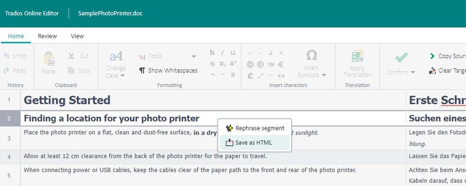
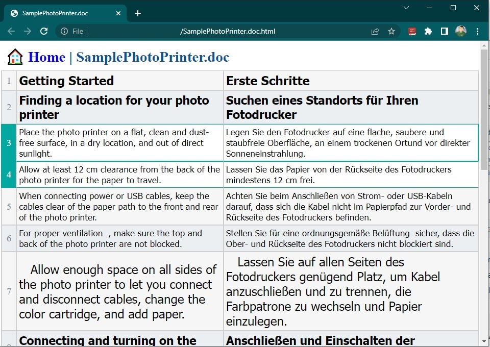

# Online Editor enhancements

Some enhancements for **Online Editor** in **Trados** for https://languagecloud.sdl.com/lc

## 💠 Features & Usage

- [x] Translate a file using Language Cloud
  - [x] Open it in Online Editor
  - [x] `Right Click` on any segment to open context menu with:
    - [x] ✨ Rephrase segment *(using [pegasus_paraphrase](https://huggingface.co/tuner007/pegasus_paraphrase))*
      - [ ] First time will ask you for `Authorization Bearer`
    - [x] 📩 Save as HTML
    - [x] Open *.html (resulted) and you can Print (as PDF) 

## 🎞 Results

## ⚙ Setup Plugin as Developer

- [x] **Download/Clone** this repo
    - [ ] as zip & Unzip it
    - [x] or `git clone https://github.com/nmatei/chrome-online-editor-enhancements.git`
    - [x] to update use `git pull`
- [x] Open [chrome://extensions/](chrome://extensions/)
    - [x] Activate `Developer mode`
- [x] **Load unpacked** Extension
- [x] Select `chrome-online-editor-enhancements` folder
- [x] Generate an API Key for [hugging faces](https://huggingface.co/inference-api)